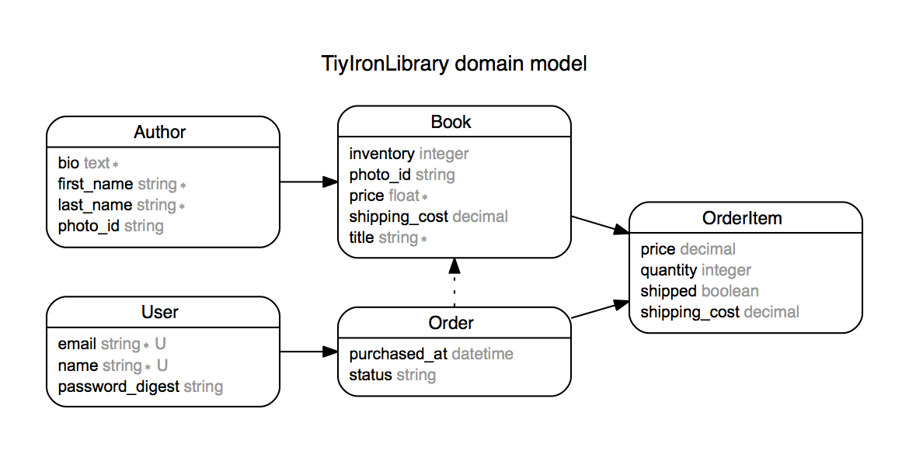

# Iron Library

This application acts as a library storing books and authors. Users have the ability to add, edit, and delete both books and authors.
The application is styled with Material Design Lite

### Root
The root url displays all of the books that are 'housed in the library'

* The navigation banner (present on all pages) links to the list of authors and includes options to add books and authors.

### Show an individual book

* The author text links to the author bio page.
* The user can edit the book record by selecting the edit button

### Edit a book

* This page also includes the option to delete the book record

## Author list

* The "Author" link in the banner links to this list of authors
* There currently isn't an option for an author photo, so a generic profile picture is currently included

## Show an individual author

* Includes a list of books by the author (with links to the book and pricing)

___
## LICENSE
This library is distributed under the MIT license. Please see the LICENSE file.
